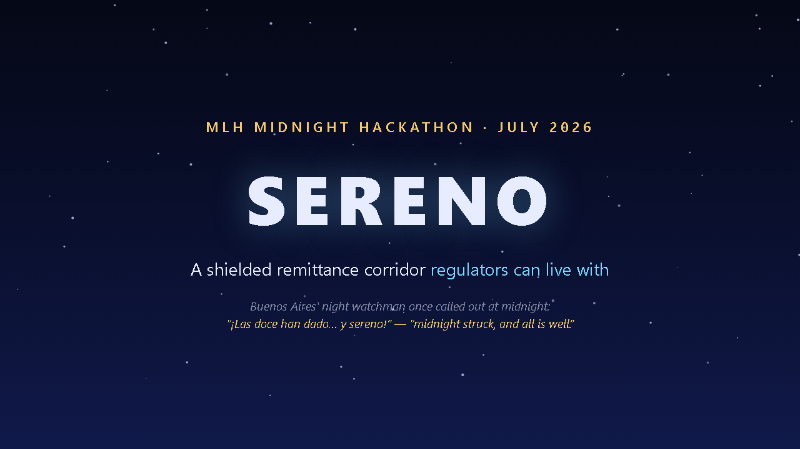
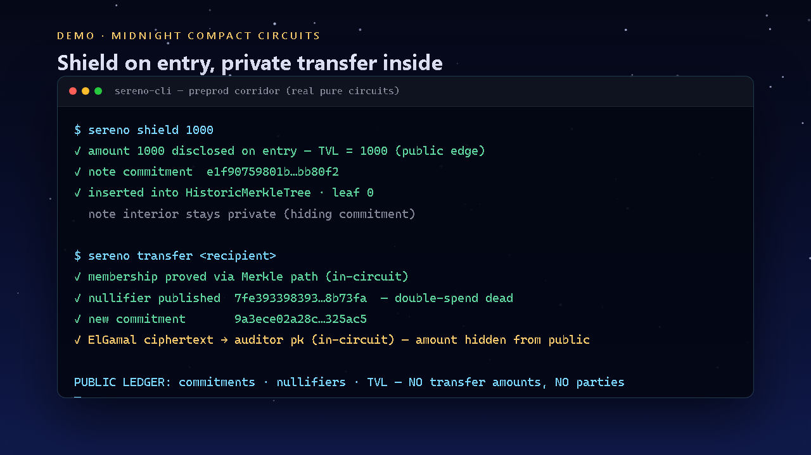

# Sereno

**Private remittance rails. Accountable edges. Built on [Midnight](https://midnight.network).**

> Named for the *sereno* — the night watchman of colonial Buenos Aires who walked the city at midnight and called *“¡…y sereno!”* when all was well.

**MLH Midnight Hackathon — July 2026 · DeFi + AI tracks**

| | |
|---|---|
| **Demo video (90s)** | _YouTube link — see Devpost submission_ |
| **Live site** | https://sereno-kappa-eight.vercel.app |
| **Repository** | https://github.com/leocagli/sereno |
| **Elevator pitch** | [ELEVATOR-PITCH.md](./ELEVATOR-PITCH.md) |
| **Video script** | [PITCH.md](./PITCH.md) |
| **Windows setup** | [SETUP.md](./SETUP.md) |
| **Agent (AI)** | `cd cli && npm run agent:demo` |





---

## Elevator pitch (30s)

Latin American remittances force a bad trade: surveillance or the black market. **Sereno** is a shielded corridor on Midnight — private in the middle, public only at entry/exit, with a designated auditor who gets cryptographic answers, not everyone’s ledger. Order without turning on every light.

---

## The problem

| Formal rails | Informal rails |
|---|---|
| High fees, slow settlement | Cheap, opaque |
| Total financial surveillance | Zero compliance story |
| Every amount is data exhaust | Growing regulatory target |

Neither extreme works for families sending money home.

## The solution

Sereno is a **note-based shielded pool** where:

| Circuit | Public visibility |
|---|---|
| `shield(amount)` | **Amount public** (accountable edge) |
| `transfer(recipientPk)` | **Private to public** (commitment + nullifier). **Auditor** gets in-circuit **ElGamal** ciphertext of the amount |
| `unshield()` | **Amount public** on exit |
| `discloseToAuditor(id)` | Owner proves commitment opens to amount under an audit request — **note not spent** |

Auditor public key is fixed at deploy. Not a backdoor for the operator — selective disclosure by design.

```
shield ──► [ Merkle tree of commitments + nullifiers ]
              │  transfer (private + ElGamal → auditor)
              ▼
           unshield / discloseToAuditor
```

## Proof of transactions (Preprod)

Live network artifacts for judges:

| Item | Value |
|---|---|
| **Network** | Midnight **Preprod** |
| **Unshielded wallet** | `mn_addr_preprod1c2ljvsln2z5aca6nmd44skj72kmdavnm03vm9v3rwm37kclfnptsffuh6t` |
| **Faucet funding** | **5,000 tNIGHT** |
| **Transaction ID** | `00bc9da4d80c86b1b7805df25384ef87228111e56734f94d64bf9f7ef148a141ab` |
| **Faucet** | https://faucet.preprod.midnight.network/ |
| **Explorers** | [preprod.midnightexplorer.com](https://preprod.midnightexplorer.com/) · [midnight-preprod.subscan.io](https://midnight-preprod.subscan.io/) |

Paste the tx hash into the explorer search to verify funding on preprod.

### Toolchain proof (local)

| Artifact | Status |
|---|---|
| Compact compiler | **0.31.1** (CLI 0.5.1) |
| Circuits compiled | `shield`, `transfer`, `unshield`, `discloseToAuditor` + prover/verifier keys |
| Pure-circuit smoke | `npm run smoke` in `cli/` — address, commitment, auditor key derivation |
| Proof server | Docker `midnightntwrk/proof-server:latest` · `:6300` |

> **Honesty for judging:** Full `deploy` / `callTx` against preprod depends on wallet-sdk sync stability with the public RPC (we hit intermittent `isSynced` / WS disconnects under Node). The **cryptographic core is compiled**; **funding is live on preprod** with the hash above. See [SETUP.md](./SETUP.md) to reproduce.

---

## Repository layout

```
sereno/
  contract/          Compact contract + witnesses (sereno.compact)
  cli/               TypeScript CLI (deploy / shield / transfer / …)
  web/               Landing page (Vercel)
  SETUP.md           Windows 11 + WSL2 runbook
  PITCH.md           2-minute video script
  ELEVATOR-PITCH.md  10s / 30s / 60s pitches
```

## Quick start (WSL2)

```bash
# Proof server
docker run -d -p 6300:6300 --name midnight-proof-server \
  midnightntwrk/proof-server:latest midnight-proof-server -v

# Contract
cd contract && npm install && npm run build

# CLI
cd ../cli && npm install && npm run build
npm run smoke          # local pure circuits
npm run demo-sim       # offline corridor simulation
npm run agent:demo     # AI agent (tools, no secret keys) — dual-track script
npm run agent          # interactive agent REPL
npm run start          # interactive preprod menu
```

### Privacy-preserving agent (AI track)

The agent is a **tool-using operator** over the Sereno corridor:

- Tools: `deploy_corridor`, `shield`, `transfer`, `disclose_to_auditor`, `unshield`, `get_public_ledger`, `get_faucet_proof`
- **Never returns secret keys** or note preimages — only public ledger fields and explicit audit disclosures
- PureCircuits (`publicKey`, `noteCommitment`, `elGamalPublicKey`) are **real**; callTx path is **simulated** when wallet sync is unavailable
- Natural language routing (ES/EN) without a cloud LLM (local policy agent) — optional LLM can wrap the same tools later

Full Windows notes: **[SETUP.md](./SETUP.md)**.

## Contract surface (Compact)

- **Ledger:** `HistoricMerkleTree` commitments, nullifier set, sealed `auditorPk`, `auditDisclosures`, `transferCiphertexts`, `totalValueLocked`
- **1-in / 1-out** transfers (same amount; splits on roadmap)
- Domain-separated hashes: `sereno:owner:pk`, `sereno:nullifier`

## Cryptographic lineage

1. **Zerocash** — notes, commitments, nullifiers  
2. **Zcash viewing keys** — auditor-directed visibility  
3. **Privacy Pools** — accountable privacy on demand  

## Regulatory context (Argentina)

**Ley 27.739** (2024) brought VASPs under AML/CFT, PSAV (CNV), and UIF reporting. Sereno’s public edges + selective disclosure are an **architecture direction** for compliance-by-design — not a claim of regulatory approval.

## Roadmap

- Native shielded token plumbing for real value custody  
- Multi-output transfers / change  
- Web wallet UX (CLI is intentional MVP scope)  
- Production auditor key ceremony  

## License

**Apache-2.0** — see [LICENSE](./LICENSE).

Built during the MLH Midnight Hackathon, July 2026, against [docs.midnight.network](https://docs.midnight.network) and official `midnightntwrk` examples.
